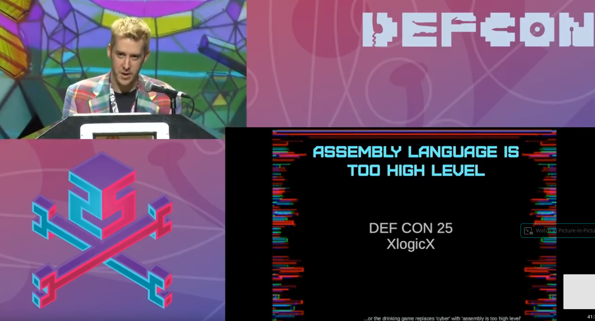
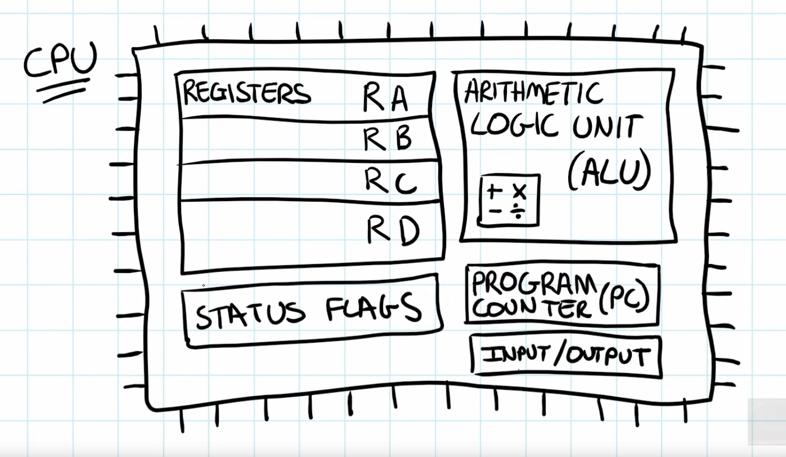
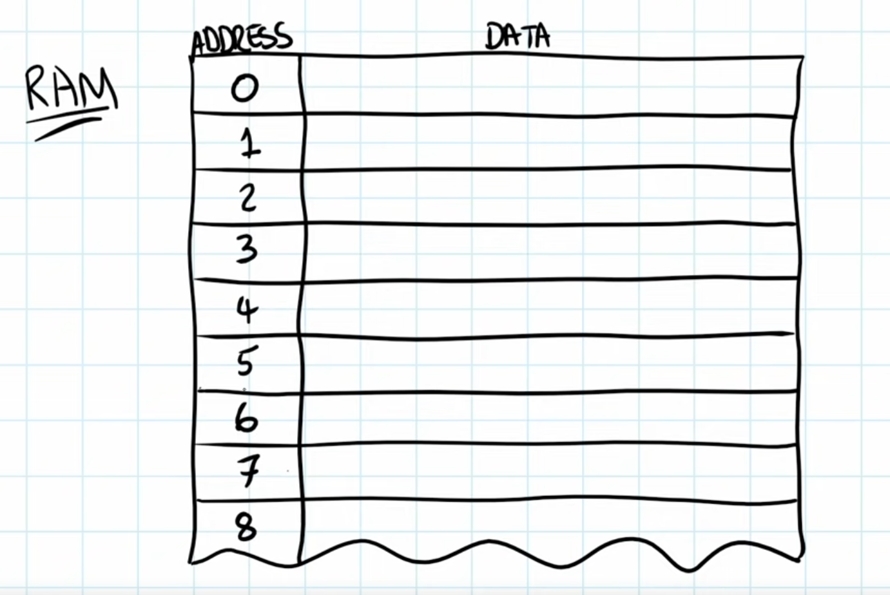
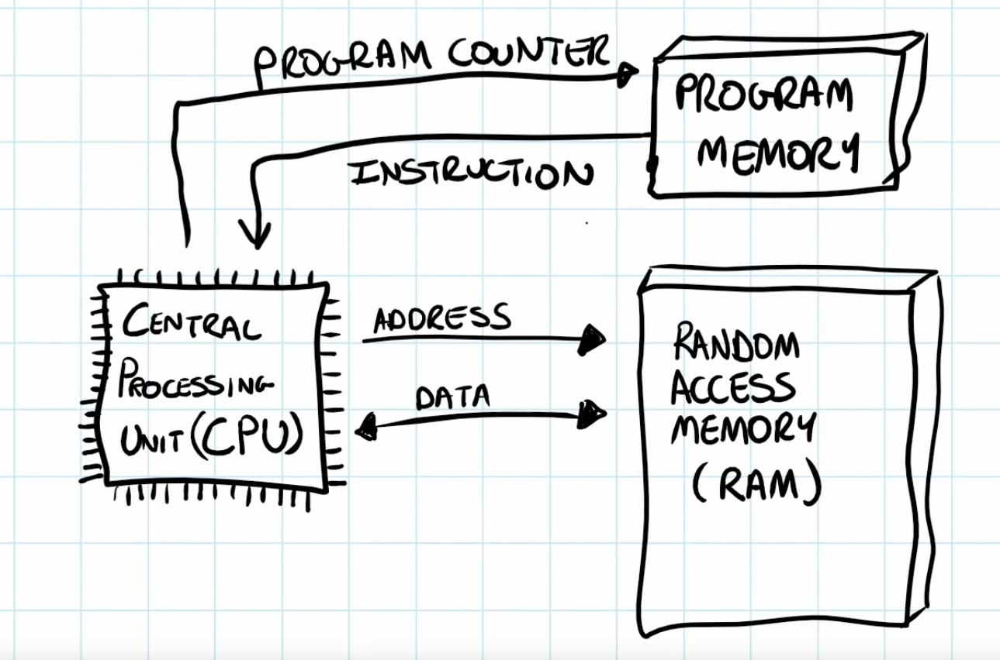

### Bas-niveaux ?

### Niveaux de langages

Haut-niveau vers bas-niveau :

* structures déclaratives : html, json
* langages de scripts, interprétés : python, javascript, lua, php
* machines virtuelles, exécutables, compilés : C, C++, pascal, ...
* assembleurs (instruction CPU)

### C'est quoi ?

* pas vraiment un langage
* quasiment pas d'abstractions
* quasiment du code machine
* plus de contrôle
* plus de code à écrire
* non-portable

### Hardware

### CPU

### Memory

### CPU + Memory

### Instructions

### Intel Manual

[Intel Manual](https://www.intel.com/content/dam/www/public/us/en/documents/manuals/64-ia-32-architectures-software-developer-instruction-set-reference-manual-325383.pdf)

### Godbolt

[Godbolt](https://godbolt.org)
